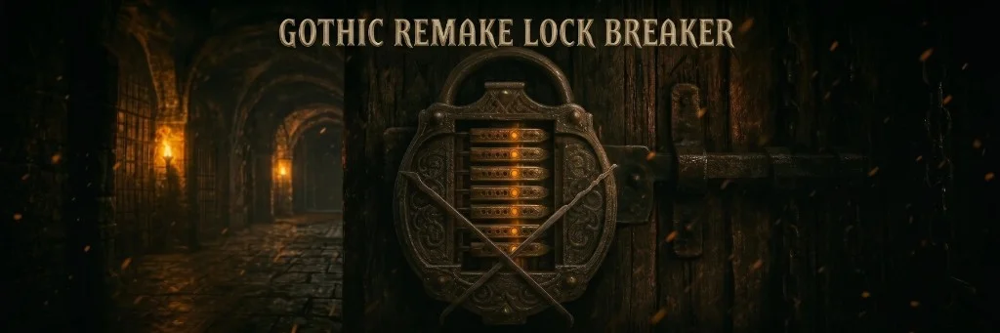
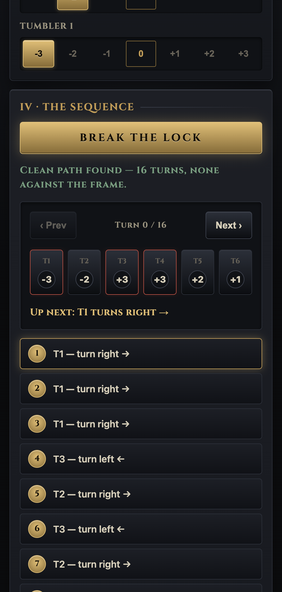
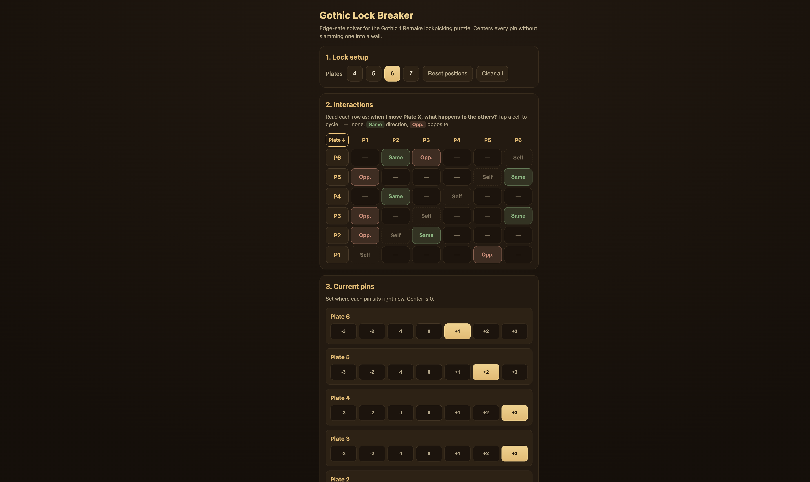
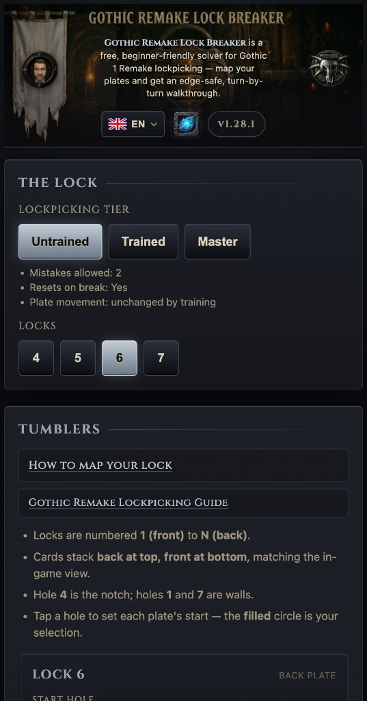

<div align="center">



# Gothic Lock Breaker

### An edge-safe solver for the Gothic 1 Remake lockpicking puzzle

Stop snapping picks on the Old Camp tower door. Map the lock, hit **Break the Lock**,
and get the exact run of turns that seats every pin in the notch — without ever grinding
one against the frame.

<br />

[**Open the solver →**](https://gothiclockbreaker.com/)

<br />

[](https://gothiclockbreaker.com/)
&nbsp;
[](https://www.pcgames.de/Gothic-Remake-Spiel-73829/News/Schloesser-knacken-Tockpick-Tool-1544814/)
&nbsp;
[](https://www.buffed.de/Gothic-Remake-Spiel-73829/News/Schloesser-knacken-Tockpick-Tool-1544814/)
&nbsp;
[](https://ko-fi.com/swarmconductor)
&nbsp;

&nbsp;

&nbsp;

&nbsp;


<br />

**Current release: v1.36.0** — see [CHANGELOG.md](CHANGELOG.md) for what changed.

**Localized links for press and communities:** [🇩🇪 German](https://gothiclockbreaker.com/de/) · [🇵🇱 Polish](https://gothiclockbreaker.com/pl/) · [🇺🇦 Ukrainian](https://gothiclockbreaker.com/uk/)

</div>

---

## Why this exists

The Gothic 1 Remake lockpicking minigame is a slider puzzle: each plate's pin must
end at the **center hole**, but the plates are wired together so moving one drags
others along. The trap is the wall — force a pin past the edge and your pick takes
damage, then breaks.

Most "solver" tools just tell you the *net* number of turns per plate. That answer is
useless in practice, because executing it in the wrong order drives a pin into the edge
halfway through and snaps your pick. **This one never does that.** It searches the real
state space and only ever returns moves that keep every pin in range. The UI stays compact
— three sections, visual mapper, built-in guide — so beginners are not fighting a spreadsheet.

<div align="center">

</div>

You get a numbered run of turns and a step-through board. Pins against the frame glow
**red**; pins one nudge away glow **amber** — on the tumbler cards and in the walkthrough —
so you can watch the sequence stay clear of every wall as you go.

> Garbage in, garbage out: the solver is only as good as the couplings you feed it.
> If a step doesn't match the game, a link on one of the lock cards is wrong — re-check that lock.
> Training with Fingers does **not** change how plates move; tap **Something off?** in the
> walkthrough for a checklist. At **Master**, set picks snapped and tap **Gone** beside dropped couplings.

## Mastery vs solver

| Tier | Mistakes | On pick break | Solver impact |
| --- | --- | --- | --- |
| Untrained | 2 | Lock resets | Edge-safe BFS on your mapped couplings |
| Trained | 4 | Progress kept | Same plate physics — more room for mistakes in-game |
| Master | 6 | One link removed per snap | Set picks snapped, tap gone links on tumbler cards |

The BFS never asks you to grind a pin past the wall. Mastery only changes how many wall
mistakes you can afford in-game and (at Master) which couplings still exist after a break.

## How it works

- Every pin sits in one of **seven holes (1–7)** on its plate. The lock opens when **all pins reach hole 4** (the center notch). Holes 1 and 7 are the walls.
- Turning a lock one notch also turns its coupled locks one notch — `With` (same
  way) or `Against` (opposite way). On each lock's card, **Turning this moves** lists
  every other lock that reacts when you turn that one. Coupling is directional, so turning
  lock A can move B even if turning B does nothing to A.
- The solver runs a breadth-first search over the bounded state space and **discards any
  turn that would grind a coupled pin past `±3`**. You get the shortest fully-safe
  sequence, or an honest "no clean path from here" if one truly doesn't exist.

State space tops out at `7^7 ≈ 820,000` states, so it solves instantly.

## Using it

<div align="center">
<table>
<tr>
<td align="center" width="62%"></td>
<td align="center" width="38%"></td>
</tr>
</table>
</div>

<br />

1. **The Lock** — choose your **lockpicking tier** (Untrained / Trained / Master), how many
   locks the mechanism has (4–7; defaults to **6**), and at Master how many **picks you've
   snapped** on this lock so you can mark dropped couplings on the tumbler cards. Once you change
   the setup, **Reset lock** returns couplings, pins, mastery tier, and count to their defaults
   — with a confirm prompt.
2. **Tumblers** — for each lock (numbered 1 front through N back), mark its **start hole**
   and which other locks move when you turn it: `·` none, `With` same way, `Against`
   opposite.
3. **Break the Lock** — read the focus card, then **Next** to walk the sequence one turn
   at a time. Each lock row shows a read-only 7-hole groove (like the tumbler cards).
   **Minimize** collapses the panel to a compact bar; **Clear** (eraser) drops the
   solved sequence. Open **Show all N steps** for the full list.

Your lock is saved locally and encoded in the page URL, so you can bookmark a tricky
lock or paste the copied link to a friend. The footer shows the running version and
links to the changelog.

## Running locally

Vite bundles the app for production; day-to-day work uses the Vite dev server. Cinzel is self-hosted (no Google Fonts round trip).

Agent instructions: [AGENTS.md](AGENTS.md).

```bash
make install        # first time only
make dev            # http://localhost:5173
make lint
make test
make check-version
make build          # output in dist/
make preview        # build + preview dist/
```

Override the dev port with `npm run dev -- --port 3000`. Run `make` with no args to list targets.

## Architecture

Native ES modules. `app.js` is the composition root; `store`, `solver`, and `view` stay pure and all depend on `domain`:

| File | Responsibility |
| --- | --- |
| `src/core/domain.js` | Constants (`POS_MIN/MAX`, `CENTER`, `LINK`, `DIR`, `MASTERY`) and pure helpers including `effectiveMatrix()`. No DOM, no storage. |
| `src/core/solver.js` | Pure `solve()` BFS + `statesAlong()`. Depends only on the domain. |
| `src/core/store.js` | Single source of truth for the lock; persistence (localStorage + URL hash) hidden inside. Depends only on the domain. |
| `src/view/index.js` + `src/view/*.js` | Pure `state -> DOM` rendering; handlers injected. `view/index.js` is a barrel over per-surface modules. Reads domain constants; no store access. |
| `src/app.js` | Composition root: bootstraps i18n, composes controllers, subscribes store to renderer. |
| `src/storage/prefs.js` | UI flag persistence (banners, visit marker, locale suggest dismiss). |
| `src/controllers/solve.js` | Solve session, walkthrough, hash banner, solve coachmark deferral. |
| `src/controllers/lock.js` | Lock mutation handlers; invalidates solve session on change. |
| `src/controllers/locale-chrome.js` | Locale suggest, i18n banner, geo hint, footer/header chrome. |
| `src/bootstrap/app-renderer.js` | Lock panel render loop (controls, tumblers, solve button, solution area). |
| `src/analytics/` | Product analytics facade; PostHog init in `posthog-init.js`, transport in `transport.js`. |
| `src/version.js` | Release version (single source of truth, reconciled against CHANGELOG/README). |
| `src/view/links.js` | External-link registry (changelog, support, GitHub issues, press) for the view layer. |
| `index.html`, `styles.css` + `styles/*.css` | Shell and theme. `styles.css` is an `@import` entry over cascade-ordered partials, flattened to one stylesheet at build. |

## Analytics

Production builds send **anonymous** usage data to [PostHog EU](https://eu.posthog.com) (hosted in the EU). We do not collect accounts, names, or personal information. Autocapture, session replay, web vitals, heatmaps, surveys, and rageclick/dead-click capture are **disabled**. Each session sends one SDK `$pageview` on load (plus a 45s visibility ping so Web Analytics Live stays accurate during long solves), explicit custom events (landing with referrer/UTM, mapping milestones, solve funnel, tutor/onboarding, guide, i18n), and registers `initial_locale` / `locale` session props. Geo country (for locale suggest) is enriched server-side from IP — no lock couplings, pin positions, or URL hash are sent. Analytics is disabled on `localhost` and `127.0.0.1` during local development.

## Feedback & issues

- **Bugs, translation fixes, feature ideas** — [GitHub issue templates](https://github.com/Dsazz/gothic-remake-lockbreaker/issues/new/choose) (see [CONTRIBUTING.md](CONTRIBUTING.md)). The site footer opens the chooser; the in-app translation banner links straight to the translation template.
- **Discuss on Reddit** — [r/worldofgothic launch thread](https://www.reddit.com/r/worldofgothic/comments/1tz9wwa/i_built_a_lockpicking_solver_for_gothic_1_remake/).
- **Tips** — optional [Ko-fi](https://ko-fi.com/swarmconductor) support; not for bug reports.

German, Polish, and Ukrainian UI copy is machine-translated and may be wrong — reports are welcome via the translation template.

## Deploy your own

1. Create a branch, make changes, open a PR to `main`. CI (lint + test) runs on the PR and must pass before merge. `main` is protected — no direct pushes, no force pushes.
2. Merge the PR. The deploy workflow builds `dist/` with Vite and publishes to GitHub Pages.
3. **Settings → Pages → Build and deployment**: source **GitHub Actions** (workflow [`.github/workflows/deploy.yml`](.github/workflows/deploy.yml)).
4. Optional custom domain: root `CNAME` is copied into `dist/` at build time — set **Custom domain** in Pages settings and point DNS (A records to GitHub Pages IPs for apex, CNAME `www` to `<user>.github.io`). Live site: [gothiclockbreaker.com](https://gothiclockbreaker.com/).

## License

MIT — see [LICENSE](LICENSE). Copyright (c) 2026 Stanislav Stepanenko (Dsazz).

## Credits

A fan-made helper for the [Gothic 1 Remake](https://gothicremake.com/) by Alkimia
Interactive. Not affiliated with or endorsed by the developers or publisher. All
artwork here is original and themed, not taken from the game.
