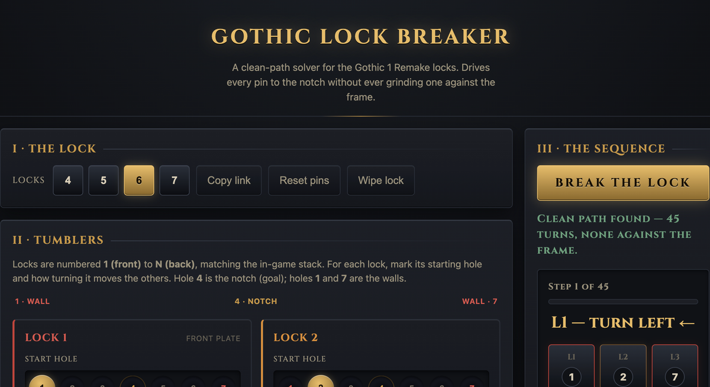

<div align="center">



# Gothic Lock Breaker

### An edge-safe solver for the Gothic 1 Remake lockpicking puzzle

Stop snapping picks on the Old Camp tower door. Map the lock, hit **Break the Lock**,
and get the exact run of turns that seats every pin in the notch — without ever grinding
one against the frame.

<br />

[**Open the solver →**](https://dsazz.github.io/gothic-remake-lockbreaker/)

<br />

[](https://dsazz.github.io/gothic-remake-lockbreaker/)
&nbsp;

&nbsp;

&nbsp;


</div>

---

## Why this exists

The Gothic 1 Remake lockpicking minigame is a slider puzzle: each plate's pin must
end at the **center hole**, but the plates are wired together so moving one drags
others along. The trap is the wall — force a pin past the edge and your pick takes
damage, then breaks.

Most "solver" tools just tell you the *net* number of turns per plate. That answer is
useless in practice, because executing it in the wrong order drives a pin into the edge
halfway through and snaps your pick. **This one never does that.** It searches the real
state space and only ever returns moves that keep every pin in range.

<div align="center">

</div>

You get a numbered run of turns and a step-through board. Pins resting against the frame
glow red, so you can watch the sequence stay clear of every wall as you go.

> Garbage in, garbage out: the solver is only as good as the couplings you feed it.
> If a step doesn't match the game, a coupling in your grid is wrong — re-check that row.

## How it works

- Every pin sits at a position from `-3` to `+3`. The lock opens when **all pins reach the notch (`0`)**.
- Turning a tumbler one notch also turns its coupled tumblers one notch — `With` (same
  way) or `Against` (opposite way). Coupling is directional: turning A can move B even if
  turning B does nothing to A.
- The solver runs a breadth-first search over the bounded state space and **discards any
  turn that would grind a coupled pin past `±3`**. You get the shortest fully-safe
  sequence, or an honest "no clean path from here" if one truly doesn't exist.

State space tops out at `7^7 ≈ 820,000` states, so it solves instantly.

## Using it

<div align="center">

</div>

<br />

1. **The Lock** — choose how many tumblers the lock has (4–7).
2. **Coupled Tumblers** — for each tumbler row, mark how turning it drags every other
   tumbler: blank for independent, `With` for the same way, `Against` for the opposite way.
3. **Starting Pins** — mark where each pin rests right now.
4. **Break the Lock** — read the numbered turns, then use **Prev / Next** to walk the
   board one turn at a time and watch every pin stay clear of the frame.

Your lock is saved locally and encoded in the page URL, so you can bookmark a tricky
lock or hand it to a friend.

## Running locally

It's plain static files — no build, no install.

```bash
# serve the folder any way you like
python3 -m http.server 8000
# then open http://localhost:8000
```

Run the test suite (pure logic, zero dependencies, includes the real Old Camp case):

```bash
node --test
```

## Architecture

Native ES modules, strict one-way dependencies `ui -> state -> domain`:

| File | Responsibility |
| --- | --- |
| `src/domain.js` | Constants (`POS_MIN/MAX`, `CENTER`, `LINK`, `DIR`) and pure helpers. No DOM, no storage. |
| `src/solver.js` | Pure `solve()` BFS + `statesAlong()`. Depends only on the domain. |
| `src/store.js` | Single source of truth for the lock; persistence (localStorage + URL hash) hidden inside. |
| `src/view.js` | Pure `state -> DOM` rendering; handlers injected. |
| `src/app.js` | The only seam wiring events to the store and solver output to the view. |
| `index.html`, `styles.css` | Shell and theme. |

## Deploy your own

1. Push to `main`.
2. **Settings → Pages → Build and deployment**: source **Deploy from a branch**,
   branch **`main`**, folder **`/ (root)`**.
3. It goes live at `https://<your-user>.github.io/<repo>/`.

## Credits

A fan-made helper for the [Gothic 1 Remake](https://gothicremake.com/) by Alkimia
Interactive. Not affiliated with or endorsed by the developers or publisher. All
artwork here is original and themed, not taken from the game.
